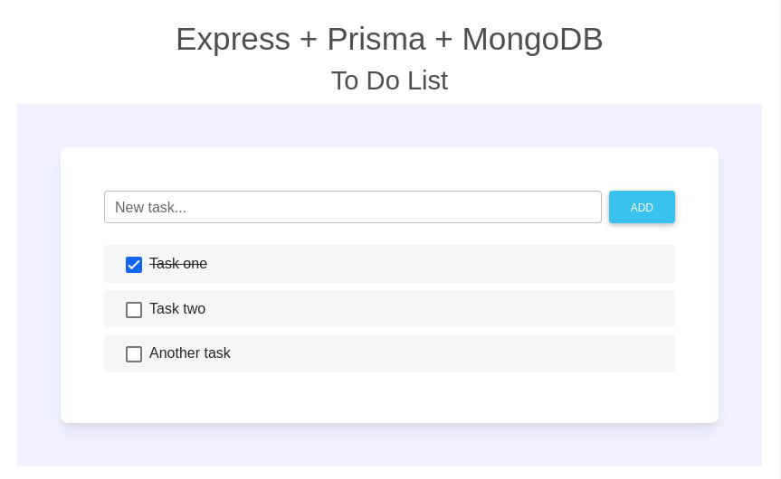

# Express.js + Prisma + MongoDB Starter Template

This is a template for a simple To Do List web app that consists of a REST API and a simple front end UI.

<p align="center"></p>

The app uses [Express.js](https://expressjs.com) as the foundation for serving both the REST API back end and the front end.
[Prisma](https://prisma.io) is used as the ORM to define the data model and interface to the [MongoDB](https://mongodb.com) database.

## Using this Starter Template

This repo can be used as an [Adaptable.io](https://adaptable.io) Starter.
For instructions on using this repo as a template and deploying to the Adaptable Cloud in just a few clicks, check out the [Starter Guide](https://adaptable.io/docs/starters/express-prisma-mongo-starter).

## Running a local dev environment

All of the following instructions assume you are in the repo root directory.

### 1. Install Node.js modules

```console
yarn
```

### 2. Run MongoDB locally

The app requires a database to store the data for the REST API.
You can run a MongoDB cluster on your local development system if you have Docker installed.

To run a MongoDB cluster using Docker:

```console
yarn run mongo-start
```

To later stop the MongoDB cluster:

> **WARNING**: All data stored in the local cluster will be deleted when the container is stopped.
> For information on persisting the database data, see [adaptable/mongo-replica-set](https://github.com/adaptable/mongo-replica-set).

```console
yarn run mongo-stop
```

### 3. Set DATABASE_URL

The app uses the environment variable `DATABASE_URL` to connect to your MongoDB instance.
Use a `.env` file to set `DATABASE_URL` in your local dev environment.
The included `sample.env` file contains the correct `DATABASE_URL` to connect to the local cluster.

To set `DATABASE_URL` to connect to your local MongoDB cluster running in Docker, copy the `sample.env` file to `.env`:

```console
cp sample.env .env
```

### 4. Start the app

```console
yarn run dev
```

> **NOTE**: By default, the app listens on port 3000. To use a different port, set the `PORT` environment variable to the desired port number.

### 5. Connect to your app

Use a web browser to connect to [http://localhost:3000](http://localhost:3000)

## Source Code

### REST API (back end)

The Prisma schema (data model) for the REST API can be found in `prisma/schema.prisma`.
The implementation of the `/todos` REST API endpoint is in `src/routes/todos.js`.

### Web UI (front end)

The layout and static portions of the front end can be found in `src/views/index.hbs`.
The dynamic part of the front end is in `public/js/client.js`.

<p align="center"><a href="https://adaptable.io"></a></p>
